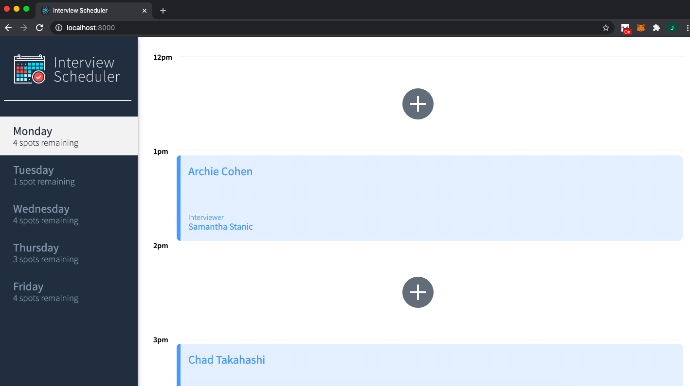
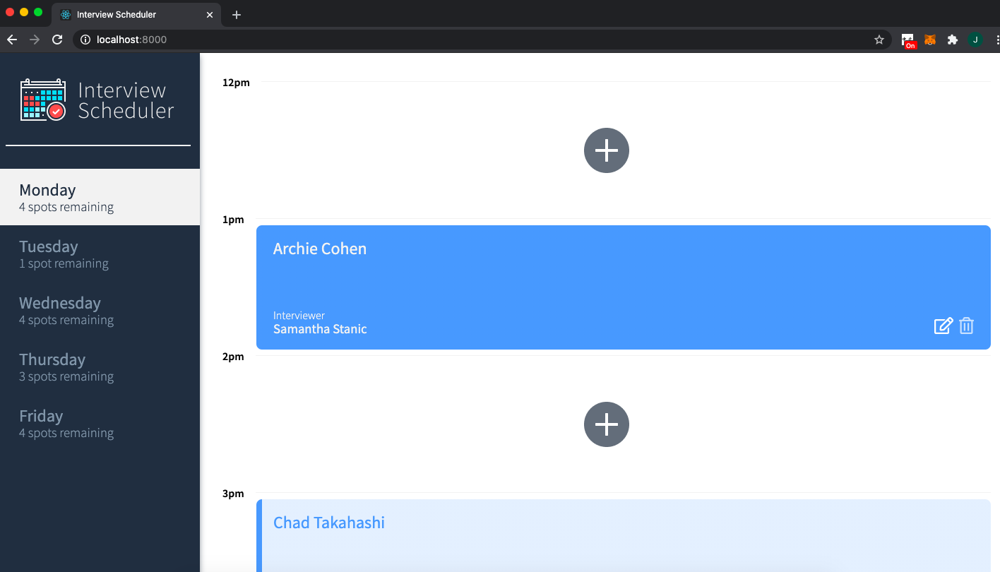
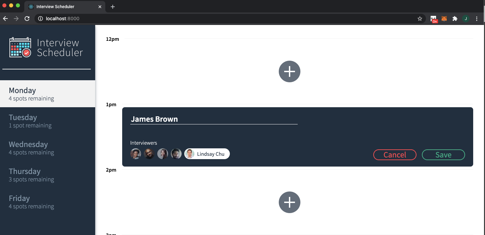
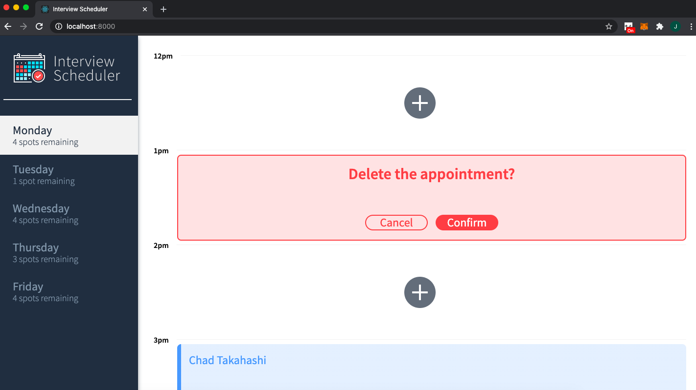
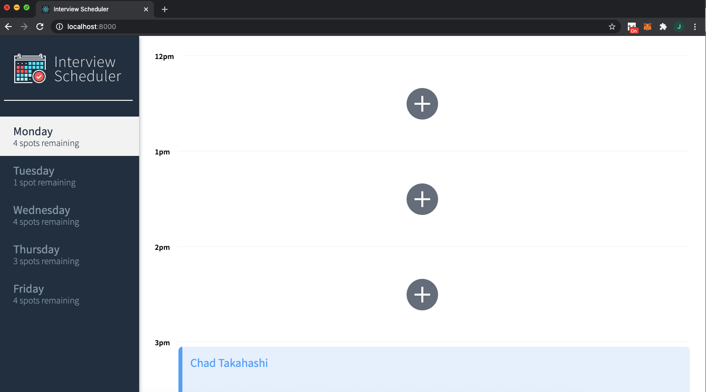

# Interview Scheduler

## Setup

Install dependencies with `npm install`.

## Running Webpack Development Server

```sh
npm start
```

## Running Jest Test Framework

```sh
npm test
```

## Running Storybook Visual Testbed

```sh
npm run storybook
```
## About the app

The scheduler app is a single page application that uses react to make asynchronous requests to an API to retrieve data relating to interviewers, appointments, days and interviews booked. The following screenshots illustrate the core functionalities: 

- A user can select a day. The navigation menu on the left shows the name of the day and the number of spots available.
- A user can book an appointment. The user clicks the plus icon and is taken to a form view.





- A user can edit an appointment. The user clicks the edit icon and is taken to the same form view.



- A user can cancel an appointment. The user clicks the cancel button and is taken to a confirmation page. The user clicks confirm and is shown the empty appointment view. 





